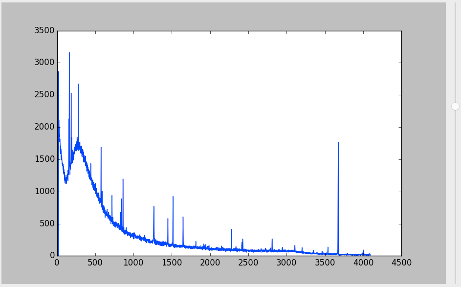

#ortec_read
chn_reader is a small python script to read binaries produced by the Ortec MCA 
emulator software such as gammavision (with file extension .chn).
The script is in no way ready, but some ideas can be taken from it.

At this point the read_chn.py script works well can be used to convert the binary into a textfile containing the spectrum data.
Usage: 
$python read_chn.py some_ortec_spectrum.Chn
will output a text file "some_ortec_spectrum.txt" which is formatted for further analysis. 

The Gui part of the code has implemented Zoom, peak detection, but is extremely experimental.

Use to any extent!
Please give me feedback.
oscar.tegmyr@gmail.com

